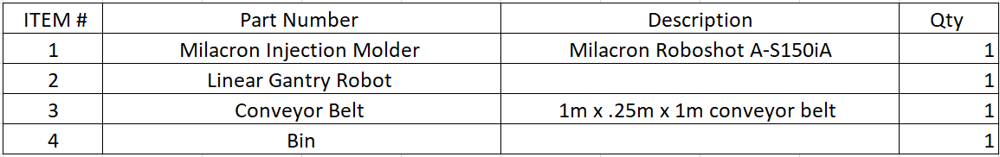
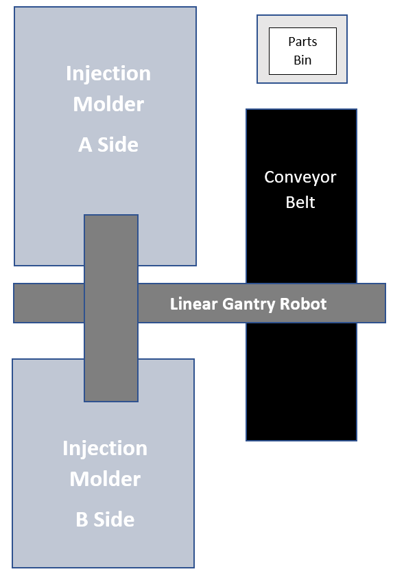
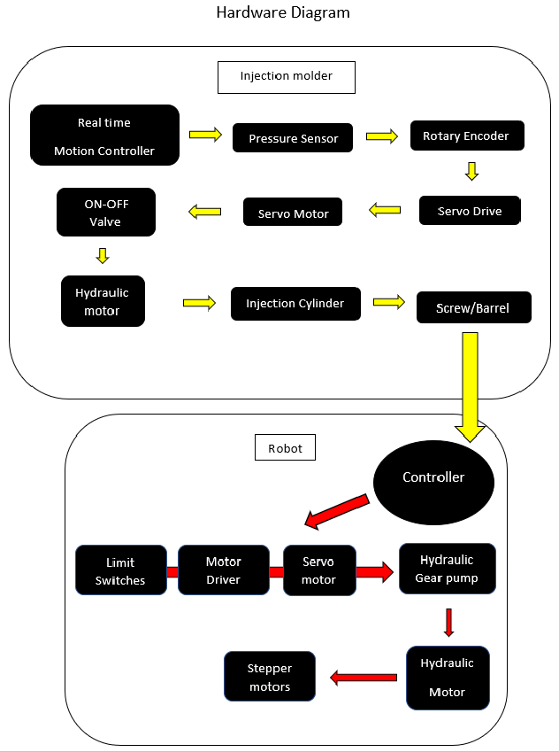
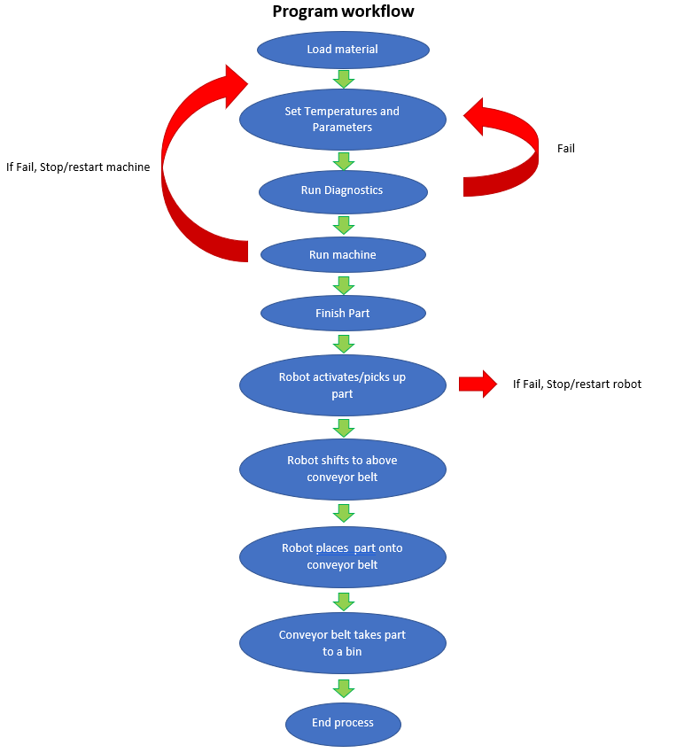

# SMFG 386 Project

Spring 2020, California State University of Chico

Project Managers: Marshall Ellis, Reese Culbertson, Ryan Martinez 

### Table of Contents
- [1. Introduction](#1-Introduction)
- [2. Bill of materials](#2-Bill_of_materials)
- [3. Cell Design](#3-Cell_Design)
- [4. Hardware Diagram](#4-Hardware_Diagram)
- [5. Program Workflow](#5-Program_Workflow)
- [6. CoppeliaSim Code to Run Simulation](#6-CoppeliaSim_Code_to_Run_Simulation)

## 1. Introduction

## 2. Bill of Materials

----------------------------------------------------------------------------------
## 3. Cell Design

-----------------------------------------------------------------------------------------------------
## 4. Hardware Diagram

-----------------------------------------------------------------------------------------------------

## 5. Program Workflow Chart

--------------------------------------------------

## 6. CoppeliaSim Code to Run Simulation

