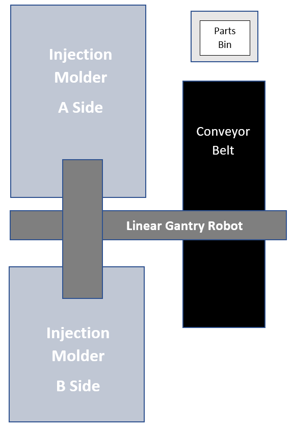
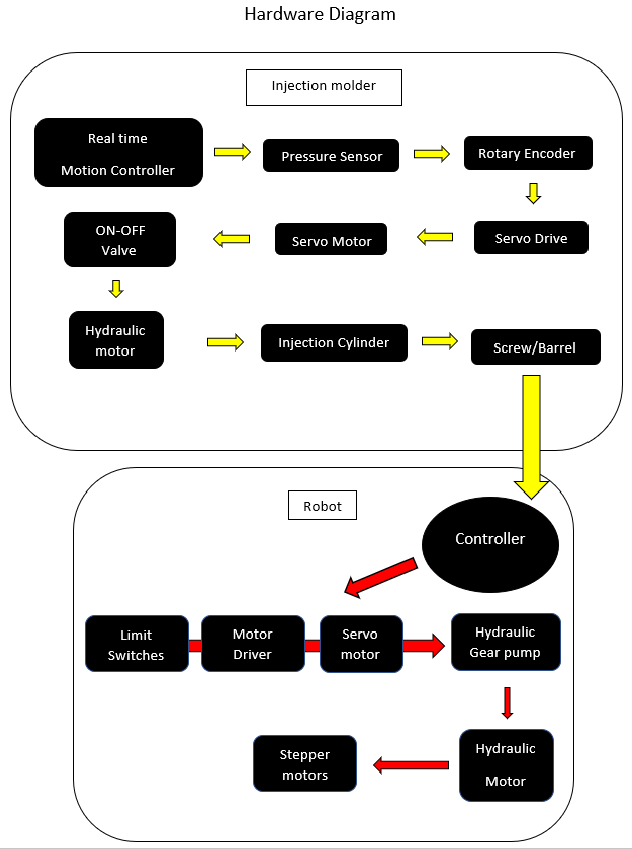
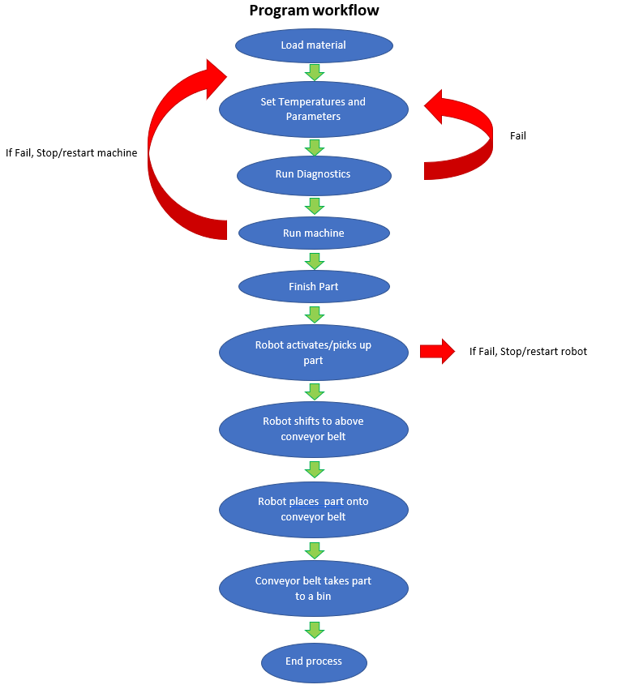
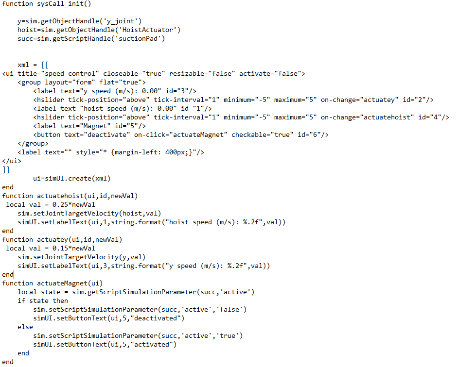

# SMFG 386 Project

Spring 2020, California State University of Chico

Project Managers: Marshall Ellis, Reese Culbertson, Ryan Martinez 

### Table of Contents
- 1. Introduction
- 2. Bill of materials
- 3. Cell Design
- 4. Hardware Diagram
- 5. Program Workflow
- 6. CoppeliaSim Code to Run Simulation

## 1. Introduction
This project consists of a robot that picks up a finished injection molded part and transfers the part horizontally to a desired location. In our case, we released the part onto a conveyor belt that would then transfer the part into a parts bin. The goal of this project was to use what we had learned in class and replicate how we would potentially use the Plastic’s Lab robot in the injection molding process. Since our group works in the Plastics lab, we were able to apply our knowledge of injection molding and the pick and place process to be able to virtually simulate this scenario. For this project we used CoppeliaSim and Solidworks to design and build both the injection molder and the gantry robot. We then used various joints and knowledge we obtained from working on Lab 1’s Crane example, to be able to apply a non-threaded child script to the scene to be able to simulate and get our projection to function as we hoped. 

## 2. Bill of Materials

### The BOM is assuming all sub-assemblies (injection molder, gantry robot), have their own BOM's.

----------------------------------------------------------------------------------
## 3. Cell Design

-----------------------------------------------------------------------------------------------------
## 4. Hardware Diagram

 

-----------------------------------------------------------------------------------------------------

## 5. Program Workflow Chart

--------------------------------------------------

## 6. CoppeliaSim Code to Run Simulation

### This is a gif of the linear gantry robot picking up the injection molded part, and placing it on the conveyour belt.

### Here is the non-threaded child script code, used to run the simulation. 

